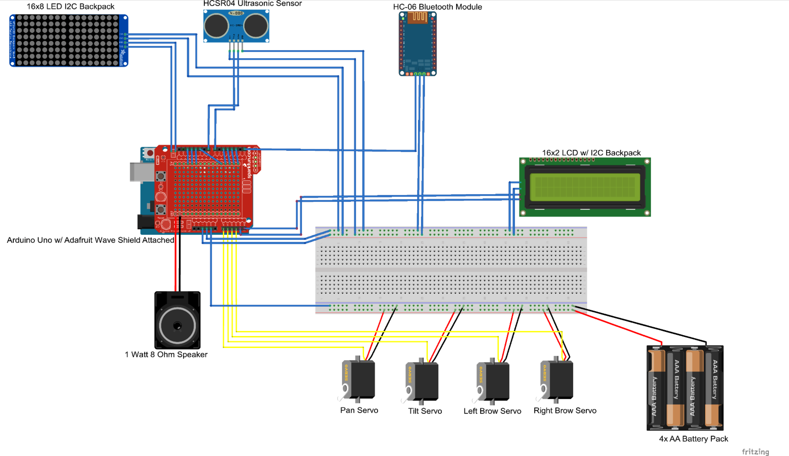

# Sensybot Marinică

| | |
|-|-|
|`Author` | Daria-Ioana CHIRCHIBOI

## Description

Marinică este un robot staționar, controlat de un Arduino UNO, capabil să exprime emoțiile prin mișcări ale capului, precum și prin afișaje LED reprezentând ochii robotului.  
Acesta reacționează la apropierea unei persoane folosind un senzor de proximitate, se sperie mișcându-se rapid și scoțând sunete specifice emoției cu ajutorul unui DFPlayer și a unei boxe ultra-subțiri.  
După fiecare sperietură, Marinică își schimbă personalitatea (Happy, Jolly, In Love, Rocker).

## Motivation

Acest proiect combină robotică, electronică și programare pentru a crea un robot interactiv care poate reacționa emoțional la mediul înconjurător, oferind o experiență practică de învățare și dezvoltare a abilităților tehnice.

## Architecture

### Block diagram

<!-- Încarcă poza block diagram în folderul schematics -->

### Schematic

<!-- Încarcă poza exportată din Fritzing în schematics -->

### Components

| Device | Usage | Price |
|--------|--------|-------|
| [Placă Arduino UNO R3 - Optimus Digital](https://www.optimusdigital.ro/en/avr-boards/4561-development-board-compatible-with-arduino-uno-r3-atmega328p-atmega16u2-50-cm-cable.html) | Controler principal | 55 RON |
| [Modul matrice LED 8x8 MAX7219 5V](https://sigmanortec.ro/modul-matrice-led-8x8-max7219-5v) | Afișaj LED ochi robot | 33 RON / buc (x2) |
| [LCD 1602](https://sigmanortec.ro/LCD-1602-p125700685) | Afișaj text suplimentar | 24 RON |
| [Servomotor MG90S, angrenaje aluminiu](https://sigmanortec.ro/servomotor-mg90s-angrenaje-aluminiu) | Mișcare cap robot | 16 RON / buc (x2) |
| [Montura servomotor suport camera 2 axe antivibratii](https://sigmanortec.ro/montura-servomotor-suport-camera-2-axe-pt-antivibratii-ptz-pentru-sg90-mg90s) | Suport cap robot | 21 RON |
| [Boxa ultra-subțire 40mm 8 ohms 0.5W](https://sigmanortec.ro/Boxa-ultra-subtire-40mm-8-ohms-0-5W-p136285784) | Sunet roboțel | 9 RON |
| [Modul Bluetooth HC-06](https://sigmanortec.ro/Modul-bluetooth-HC-06-p125923853) | Comunicare wireless | 18 RON |
| [Suport 4 baterii AA cu capac și întrerupător](https://sigmanortec.ro/Suport-4-baterii-AA-cu-capac-si-intrerupator-p172447738) | Alimentare | 9 RON |
| [Breadboard 830 puncte MB-102](https://sigmanortec.ro/Breadboard-830-puncte-MB-102-p125923983) | Prototipare circuit | 10 RON |
| [40 Fire Dupont 20cm Tata-Tata](https://sigmanortec.ro/40-Fire-Dupont-20cm-Tata-Tata-p210851325) | Cablare | 12 RON |
| [40 Fire Dupont 20cm Tata-Mama](https://sigmanortec.ro/40-Fire-Dupont-20cm-Tata-Mama-p210854317) | Cablare | 12 RON |
| [40 Fire Dupont 20cm Mama-Mama](https://sigmanortec.ro/40-Fire-Dupont-20cm-Mama-Mama-p166528315) | Cablare | 12 RON |
| [Modul MP3 Player DFPlayer Mini](https://ardushop.ro/ro/module/1473-modul-mp3-player-dfplayer-mini-6427854021755.html?gad_source=1&gad_campaignid=22058879462&gclid=CjwKCAjw24vBBhABEiwANFG7yxlp13zlUpmcgfizUjk4fZ9te46kDDH0UlXyVcytCSXZWNLtkp91XhoCW3UQAvD_BwE) | Redare sunet | 45 RON |
| [Modul senzor ultrasonic HC-SR04](https://ardushop.ro/ro/electronica/2289-modul-senzor-ultrasonic-detector-distanta-hc-sr04-6427854030726.html) | Detectare proximitate | 15 RON |

---

### Libraries

| Library | Description | Usage |
|---------|-------------|-------|
| [Servo.h](https://www.arduino.cc/en/Reference/Servo) | Control servomotoare | Controlul mișcărilor capului |
| [DFPlayer Mini Library](https://github.com/DFRobot/DFRobotDFPlayerMini) | Control modul MP3 DFPlayer Mini | Redare fișiere audio pentru emoții |
| [LedControl](https://github.com/wayoda/LedControl) | Control matrice LED MAX7219 | Afișare ochi robot |

## Log

### Week 6 - 12 May

- Configurare hardware și conectare componente  
- Testare individuală a senzorilor și actuatoarelor

### Week 7 - 19 May

- Dezvoltare cod control și logica schimbării personalității  
- Integrare module LED și sunet

### Week 20 - 26 May

- Testare finală și optimizare cod  
- Documentare completă și pregătire prezentare

## Reference links

- [Tutorial matrice LED MAX7219](https://www.youtube.com/watch?v=wdgULBpRoXk&t=1s&ab_channel=BenEater)  
- [Articol senzori ultrasonici](https://www.explainthatstuff.com/induction-motors.html)  
- [Proiect Arduino similar](https://projecthub.arduino.cc/)  

---

## Video demo

<!-- Încarcă video-ul tău în repo, în folderul 'videos', apoi pune link-ul aici -->

*(Click pe imagine pentru a vedea video-ul)*
